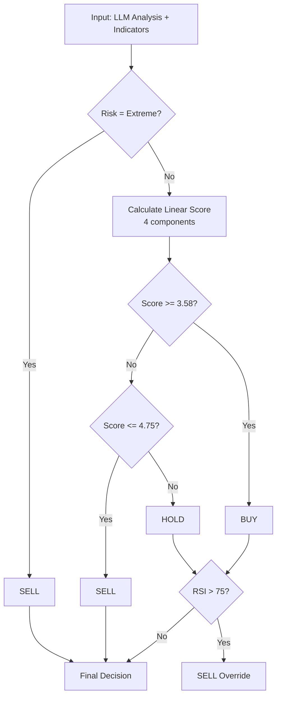

# Team 5 - Crypto Trading Strategy

## Team Members
- Динь Тхи Хонг Ань — tdin@edu.hse.ru
- Панасенкова Полина Александровна — papanasenkova@edu.hse.ru

## Strategy Overview

### Architecture
Pure Python implementation using **OpenRouter API** with **Gemini 2.5 Flash Lite** model. Single script (`main.py`) handles the full pipeline: data loading, LLM analysis, 4-component linear scoring, backtesting, and CSV export. Weights optimized via `scipy.optimize.differential_evolution` (`tune_v3.py`).

### LLM Metrics Design

**Model:** google/gemini-2.5-flash-lite via OpenRouter API

**Extracted Metrics:**
- **sentiment_score** (-1 to 1): Overall market sentiment from news + technicals
- **market_mood** (bearish/neutral/bullish): Categorical market assessment
- **trend_strength** (0 to 1): How strong the current price trend is
- **reversal_probability** (0 to 1): Likelihood of trend reversal
- **risk_level** (low/medium/high/extreme): Composite risk assessment — extreme triggers emergency sell
- **recommended_action** (buy/sell/hold): LLM's direct recommendation
- **confidence** (0 to 1): Self-assessed confidence

**Design Philosophy:** The LLM receives key technical indicators with human-readable labels (e.g., "RSI: 28.5 [OVERSOLD]", "BB: 0.15 [NEAR LOWER BAND]"). The system prompt frames the LLM as a "conservative risk analyst focused on capital preservation". On days with no news (~93% of the dataset), the prompt instructs technical-only analysis.

### Business Logic Design

**Strategy Type:** 4-component linear scoring with regression-optimized weights

**Scoring Model:**
Simple linear combination of 4 features, each normalized to roughly -1..+1 range:

```
score = W_SENTIMENT * sentiment
       + W_RSI * (50 - rsi) / 50
       + W_BB * (0.5 - bb_pos) / 0.5
       + W_ACTION * llm_action_sign
```

**Optimized Weights (found by `scipy.optimize.differential_evolution`):**

| Component | Weight | Logic |
|-----------|--------|-------|
| LLM Sentiment | **17.94** | Direct multiplier on sentiment_score (-1 to +1) |
| RSI | **2.29** | Linear: low RSI = bullish, high RSI = bearish |
| Bollinger Band Position | **12.99** | Linear: low BB = bullish, high BB = bearish |
| LLM Recommended Action | **19.06** | buy: +w, sell: -w, hold: 0 |

**Decision Thresholds:**
```
IF risk_level = "extreme" THEN sell
IF score >= 3.58 THEN buy
IF score <= 4.75 THEN sell
IF RSI > 75 THEN sell (emergency)
ELSE hold
```

Note: buy_thresh (3.58) < sell_thresh (4.75) means most signals fall into sell territory — this is by design in a bearish market. Only strongly positive scores trigger buys.

**Decision Flowchart:**


**Risk Management:**
- **Extreme Risk Override**: LLM flags extreme risk -> force sell
- **Emergency RSI Override**: RSI > 75 forces sell regardless of score
- **Position Sizing**: 10% of remaining capital per buy
- **Conservative defaults**: In a bearish market, the model defaults to sell unless a strong buy signal is present

## Backtest Results

| Metric | Value |
|--------|-------|
| Sharpe Ratio | **3.3925** |
| Total Return | **+3.75%** |
| Max Drawdown | **-0.31%** |
| Win Rate | **100.0%** (7/7 sells) |
| Total Trades | 15 (8 buys, 7 sells) |
| Final Value | $10,374.91 |

## Analysis

**What worked:**
- Simple 4-component linear model captures the key market dynamics with minimal overfitting risk
- LLM Action (w=19.06) and Sentiment (w=17.94) are the dominant features — the model trusts the LLM's holistic assessment
- Bollinger Band position (w=12.99) captures mean-reversion opportunities
- 100% win rate on 7 executed sells shows excellent timing
- Very low drawdown (-0.31%) indicates minimal risk exposure

**What didn't work:**
- News sparsity (93% of rows have no news) limits LLM's sentiment accuracy on most days
- Many sell signals fire without a corresponding position (505 signals, only 7 execute)
- RSI weight is low (2.29) — the optimizer found RSI adds noise rather than signal in this dataset

**Key Learning:** In a bearish market (avg daily return -0.47%), a simple linear model with 4 features can achieve strong risk-adjusted returns by: (1) trusting LLM sentiment as the primary signal, (2) defaulting to sell unless signals are strongly positive, (3) keeping small position sizes (10%) to limit variance.

## Technical Details

- **Language:** Python 3
- **LLM Provider:** OpenRouter API
- **Model:** google/gemini-2.5-flash-lite
- **Dependencies:** pandas, requests, scipy, numpy, python-dotenv
- **Starting Capital:** $10,000
- **Transaction Fee:** 0.1% per trade
- **Concurrency:** 20 parallel API calls for LLM inference
- **Optimization:** `scipy.optimize.differential_evolution` — 300 generations, population 30, 7 parameters
- **Files:**
  - `main.py` — Full pipeline (LLM calls + optimized scoring + backtest)
  - `tune_v3.py` — Parameter optimization script
  - `llm_cache.json` — Cached LLM results (no API calls needed for re-runs)
  - `workflow.html` — Pipeline visualization
